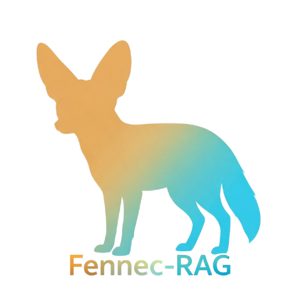

<p align="center">
  
</p>
<div align="center">

<br/>

```
███████╗███████╗███╗   ██╗███╗   ██╗███████╗ ██████╗    ██████╗  █████╗  ██████╗
██╔════╝██╔════╝████╗  ██║████╗  ██║██╔════╝██╔════╝    ██╔══██╗██╔══██╗██╔════╝
█████╗  █████╗  ██╔██╗ ██║██╔██╗ ██║█████╗  ██║         ██████╔╝███████║██║  ███╗
██╔══╝  ██╔══╝  ██║╚██╗██║██║╚██╗██║██╔══╝  ██║         ██╔══██╗██╔══██║██║   ██║
██║     ███████╗██║ ╚████║██║ ╚████║███████╗╚██████╗    ██║  ██║██║  ██║╚██████╔╝
╚═╝     ╚══════╝╚═╝  ╚═══╝╚═╝  ╚═══╝╚══════╝ ╚═════╝    ╚═╝  ╚═╝╚═╝  ╚═╝ ╚═════╝
```

<br/>

**A Professional, Modular & Arabic-Native Retrieval-Augmented Generation Framework**

<br/>


<br/>

</div>

---

## 📖 Overview

**Fennec RAG** is a comprehensive, production-grade Retrieval-Augmented Generation (RAG) framework built in Python. It is designed from the ground up to be **modular**, **extensible**, and **multilingual** — with first-class native support for **Arabic NLP**. Whether you are building a simple Q&A system or a complex enterprise-grade knowledge pipeline, Fennec RAG provides every building block you need in one cohesive library.

The framework follows a clean separation of concerns: each component (document loaders, chunkers, embedders, vector databases, LLM interfaces, and RAG orchestrators) is independently swappable, making it easy to mix and match providers without rewriting your pipeline.

---

## ✨ Key Features

### 🧠 Multiple Advanced RAG Architectures
Fennec RAG ships with a rich set of RAG variants out of the box:

- **Standard RAG** — Classic retrieve-then-generate pipeline with a powerful reranker
- **Graph RAG** — Knowledge graph-based retrieval that captures entity relationships and multi-hop reasoning over structured knowledge
- **Multi-Hop RAG** — Decomposes complex queries into sub-questions and iteratively retrieves evidence across multiple hops, with early-stop confidence gating
- **Self-Improving RAG** — Automatically evaluates retrieval quality, refines queries, and re-retrieves when the initial context is insufficient — also includes HyDE (Hypothetical Document Embeddings) support
- **Domain-Specific RAG** — Domain-aware retrieval with preset domains (Medical, Legal, Education, Finance, HR, Engineering, Islamic Studies) and full support for user-defined custom domains
- **Federated RAG** — Queries multiple independent RAG sources in parallel and intelligently aggregates the results using weighted, voting, ranking, or merge strategies, with built-in circuit breaker protection
- **Streaming RAG** — Token-level streaming output with typed event system, async/sync support, and metadata events for real-time applications
- **Hybrid Search RAG** — Combines semantic vector search with lexical methods (BM25 / TF-IDF) for superior recall

### 🌍 First-Class Arabic Language Support
- Dedicated `ArabicTextChunker` with sentence-aware splitting optimized for Arabic morphology
- `ArabicEmbedder` with multiple normalization levels: minimal, standard, and aggressive
- Arabic normalization pipeline covering hamza variants, alef forms, taa marbuta, diacritics, tatweel, and repeated characters
- Arabic-aware NER for query decomposition in Multi-Hop RAG via Stanza integration
- Bilingual codebase — all modules are documented in both Arabic and English

### 🔌 Wide LLM Provider Support
Fennec RAG integrates natively with all major LLM providers through a clean, unified interface. See the full [LLM Support](#-llm-support) section below.

### 🗄️ Vector Database Flexibility
Plug in your preferred vector database with zero pipeline changes. See the full [Vector Database Support](#%EF%B8%8F-vector-database-support) section below.

### 🛡️ Built-in Hallucination Guard
A dedicated `HallucinationGuard` layer wraps any LLM interface and provides:
- Detection of factual errors, made-up information, conflicting claims, unsupported assertions, context deviation, and overconfidence
- Confidence scoring (Very High / High / Medium / Low / Very Low)
- Configurable guard presets and domain-specific guard configurations
- `ProtectedLLMInterface` — a drop-in replacement for any LLM interface that transparently applies hallucination detection

### ⚡ Intelligent Multi-Level Caching
- Multi-level cache architecture with configurable TTL and LRU/LFU eviction strategies
- `CacheMetrics` for monitoring hit/miss rates and eviction counts
- Router-level caching for semantic routing results
- Federated RAG result caching with TTL

### 🔀 Semantic Router
An intelligent query routing layer that classifies incoming queries and routes them to the appropriate RAG pipeline or response handler. Supports route collections, caching, and configurable routing metrics.

### 📊 Built-in Evaluator & Dashboard
- `RAGEvaluator` with retrieval metrics (Precision, Recall, MRR, NDCG) and generation metrics (BLEU, ROUGE, semantic similarity)
- `EvalReport` for structured evaluation reporting
- Visual HTML dashboard generation via `generate_dashboard`

### 📄 Rich Document Loaders
Out-of-the-box support for loading from: Plain text, PDF, DOCX, CSV, JSON, HTML, Web URLs, and entire directory trees — with an `AutoLoader` that detects file types automatically.

### 🖥️ Instant Chat UI
`RagChatUI` converts any RAG pipeline into a fully functional browser-based chat interface in a single line, with session management, file upload processing, and streaming support.

---

## 🤖 LLM Support

Fennec RAG provides a unified `BaseLLMInterface` with native integrations for all major providers:

| Provider | Interface Class | Notes |
|---|---|---|
| **OpenAI** | `OpenAIInterface` | GPT-4, GPT-3.5, and all OpenAI-compatible endpoints |
| **Anthropic** | `AnthropicInterface` | Claude 3 family and all Anthropic models |
| **Google Gemini** | `GeminiInterface` | Gemini Pro, Gemini Flash |
| **Mistral AI** | `MistralInterface` | Mistral 7B, Mixtral, and Mistral API |
| **Ollama** | `OllamaInterface` | Any locally-served model via Ollama (LLaMA 3, Phi-3, Qwen, etc.) |
| **HuggingFace** | `HuggingFaceInterface` | Transformers pipeline for local inference (supports GPT, LLaMA, Falcon, BLOOM, T5, BART, AraBERT, and more) |

All interfaces are wrapped transparently by the `ProtectedLLMInterface` for optional hallucination guarding.

---

## 🗄️ Vector Database Support

| Database | Class | Type |
|---|---|---|
| **FAISS** | `FAISSVectorDatabase` | Local, high-performance, CPU/GPU |
| **ChromaDB** | `ChromaVectorDatabase` | Local or server, open-source |
| **Pinecone** | `PineconeVectorDatabase` | Managed cloud, production-scale |

All databases implement the same `VectorDatabaseBase` interface, making migrations between providers seamless.

---

## 📦 Embedding Support

| Provider | Class | Arabic Support |
|---|---|---|
| **OpenAI** | `OpenAIEmbedder` | Good |
| **Google Gemini** | `GeminiEmbedder` | Excellent |
| **Mistral AI** | `MistralEmbedder` | Good |
| **HuggingFace** | `HuggingFaceEmbedder` | Model-dependent |
| **Ollama** | `OllamaEmbedder` | Model-dependent |
| **Arabic Specialized** | `ArabicEmbedder` | Native — purpose-built |

---

## 🆚 Why Fennec RAG?

The RAG ecosystem is crowded, so here is a direct comparison of what makes Fennec RAG stand out:

| Capability | Fennec RAG | LangChain | LlamaIndex |
|---|:---:|:---:|:---:|
| Arabic-native chunking & normalization | ✅ | ❌ | ❌ |
| Built-in Hallucination Guard | ✅ | ❌ | ❌ |
| Graph RAG out-of-the-box | ✅ | Partial | ✅ |
| Multi-Hop RAG with early-stop | ✅ | Manual | Partial |
| Self-Improving RAG + HyDE | ✅ | Manual | Partial |
| Federated multi-source RAG | ✅ | ❌ | ❌ |
| Domain-Specific RAG with presets | ✅ | Manual | Manual |
| Instant browser Chat UI | ✅ | External | External |
| Semantic Router built-in | ✅ | Partial | ❌ |
| Multi-level cache system | ✅ | ❌ | ❌ |
| Built-in evaluator + dashboard | ✅ | External | Partial |
| Zero-dependency component swapping | ✅ | Complex | Complex |
| Streaming RAG (async + sync) | ✅ | Partial | Partial |
| Circuit breaker for external sources | ✅ | ❌ | ❌ |

Fennec RAG was built specifically for developers who want a **single, cohesive framework** that handles the full RAG lifecycle — from document ingestion to response generation — without assembling dozens of third-party packages. It is particularly valuable for Arabic-language applications, where most competing frameworks provide little to no native support.

---

## 🏗️ Architecture Overview

```
fennec-rag/
├── document_loaders/     # PDF, DOCX, CSV, JSON, HTML, Web, Directory, AutoLoader
├── chunks/               # Arabic chunker, Multilingual chunker, Character/Token splitters
├── embeddings/           # OpenAI, Gemini, Mistral, HuggingFace, Ollama, Arabic
├── vector_database/      # FAISS, ChromaDB, Pinecone
├── llm/                  # OpenAI, Anthropic, Gemini, Mistral, HuggingFace, Ollama
│   └── hallucination/    # Hallucination Guard, Protected LLM Interface
├── context/              # Context manager, allocation strategies
├── cache/                # Multi-level cache, TTL, LRU/LFU strategies
├── router/               # Semantic Router, Route Collections
├── evaluator/            # RAGEvaluator, retrieval & generation metrics, dashboard
└── rag/
    ├── core/             # Base RAG system, RAGConfig, Reranker, Prompt Router
    ├── graph_rag/        # GraphRAG, Knowledge Graph, Nodes, Edges
    ├── multi_hop/        # MultiHopRAG, Query Decomposer, Hop Strategies
    ├── self_improving_rag/ # SelfImprovingRAG, HyDE
    ├── domain_rag/       # DomainSpecificRAG, Preset Domains
    ├── federated_rag/    # FederatedRAG, CircuitBreaker
    ├── streaming_rag/    # StreamingRAG, async/sync streaming
    ├── hybrid_search/    # HybridSearch, BM25, TF-IDF
    └── rag_ui/           # RagChatUI, session management
```

---

## 👨‍💻 Developer

<div align="center">

**Yousef Khalil**

📧 [yousefkhalil435@gmail.com](mailto:yousefkhalil435@gmail.com)

</div>

---

<div align="center">

*Built with ❤️ for the Arabic-speaking developer community and beyond.*

</div>
